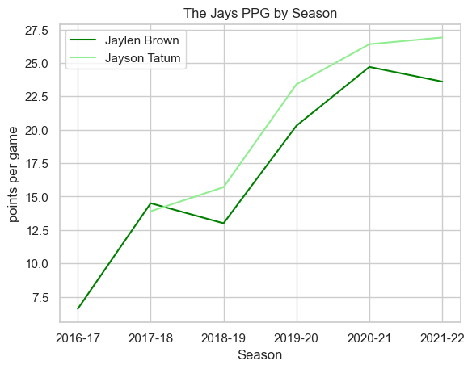
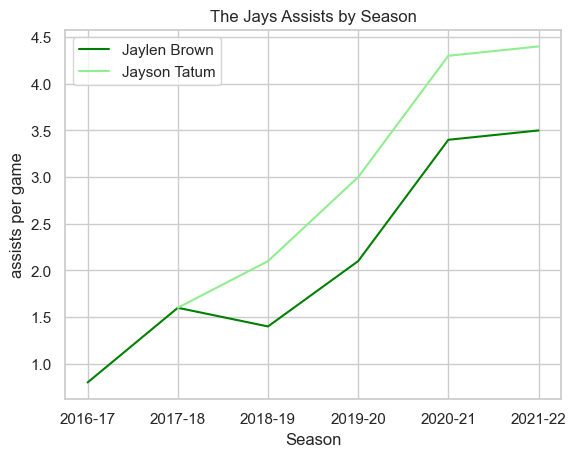
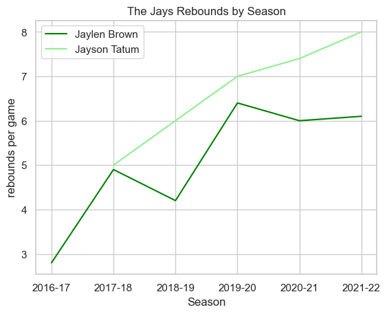

# NBA EXPLORATORY DATA ANALYSIS

# First we will import the proper packeges, modules and load our data set


```python
import pandas as pd
import csv as csv
NBA = pd.read_csv('NBA.csv', index_col=0)
```


```python
NBA
```


<div>
<style scoped>
    .dataframe tbody tr th:only-of-type {
        vertical-align: middle;
    }

    .dataframe tbody tr th {
        vertical-align: top;
    }

    .dataframe thead th {
        text-align: right;
    }
</style>
<table border="1" class="dataframe">
  <thead>
    <tr style="text-align: right;">
      <th></th>
      <th>player_name</th>
      <th>team_abbreviation</th>
      <th>age</th>
      <th>player_height</th>
      <th>player_weight</th>
      <th>college</th>
      <th>country</th>
      <th>draft_year</th>
      <th>draft_round</th>
      <th>draft_number</th>
      <th>...</th>
      <th>pts</th>
      <th>reb</th>
      <th>ast</th>
      <th>net_rating</th>
      <th>oreb_pct</th>
      <th>dreb_pct</th>
      <th>usg_pct</th>
      <th>ts_pct</th>
      <th>ast_pct</th>
      <th>season</th>
    </tr>
  </thead>
  <tbody>
    <tr>
      <th>0</th>
      <td>Dennis Rodman</td>
      <td>CHI</td>
      <td>36.0</td>
      <td>198.12</td>
      <td>99.790240</td>
      <td>Southeastern Oklahoma State</td>
      <td>USA</td>
      <td>1986</td>
      <td>2</td>
      <td>27</td>
      <td>...</td>
      <td>5.7</td>
      <td>16.1</td>
      <td>3.1</td>
      <td>16.1</td>
      <td>0.186</td>
      <td>0.323</td>
      <td>0.100</td>
      <td>0.479</td>
      <td>0.113</td>
      <td>1996-97</td>
    </tr>
    <tr>
      <th>1</th>
      <td>Dwayne Schintzius</td>
      <td>LAC</td>
      <td>28.0</td>
      <td>215.90</td>
      <td>117.933920</td>
      <td>Florida</td>
      <td>USA</td>
      <td>1990</td>
      <td>1</td>
      <td>24</td>
      <td>...</td>
      <td>2.3</td>
      <td>1.5</td>
      <td>0.3</td>
      <td>12.3</td>
      <td>0.078</td>
      <td>0.151</td>
      <td>0.175</td>
      <td>0.430</td>
      <td>0.048</td>
      <td>1996-97</td>
    </tr>
    <tr>
      <th>2</th>
      <td>Earl Cureton</td>
      <td>TOR</td>
      <td>39.0</td>
      <td>205.74</td>
      <td>95.254320</td>
      <td>Detroit Mercy</td>
      <td>USA</td>
      <td>1979</td>
      <td>3</td>
      <td>58</td>
      <td>...</td>
      <td>0.8</td>
      <td>1.0</td>
      <td>0.4</td>
      <td>-2.1</td>
      <td>0.105</td>
      <td>0.102</td>
      <td>0.103</td>
      <td>0.376</td>
      <td>0.148</td>
      <td>1996-97</td>
    </tr>
    <tr>
      <th>3</th>
      <td>Ed O'Bannon</td>
      <td>DAL</td>
      <td>24.0</td>
      <td>203.20</td>
      <td>100.697424</td>
      <td>UCLA</td>
      <td>USA</td>
      <td>1995</td>
      <td>1</td>
      <td>9</td>
      <td>...</td>
      <td>3.7</td>
      <td>2.3</td>
      <td>0.6</td>
      <td>-8.7</td>
      <td>0.060</td>
      <td>0.149</td>
      <td>0.167</td>
      <td>0.399</td>
      <td>0.077</td>
      <td>1996-97</td>
    </tr>
    <tr>
      <th>4</th>
      <td>Ed Pinckney</td>
      <td>MIA</td>
      <td>34.0</td>
      <td>205.74</td>
      <td>108.862080</td>
      <td>Villanova</td>
      <td>USA</td>
      <td>1985</td>
      <td>1</td>
      <td>10</td>
      <td>...</td>
      <td>2.4</td>
      <td>2.4</td>
      <td>0.2</td>
      <td>-11.2</td>
      <td>0.109</td>
      <td>0.179</td>
      <td>0.127</td>
      <td>0.611</td>
      <td>0.040</td>
      <td>1996-97</td>
    </tr>
    <tr>
      <th>...</th>
      <td>...</td>
      <td>...</td>
      <td>...</td>
      <td>...</td>
      <td>...</td>
      <td>...</td>
      <td>...</td>
      <td>...</td>
      <td>...</td>
      <td>...</td>
      <td>...</td>
      <td>...</td>
      <td>...</td>
      <td>...</td>
      <td>...</td>
      <td>...</td>
      <td>...</td>
      <td>...</td>
      <td>...</td>
      <td>...</td>
      <td>...</td>
    </tr>
    <tr>
      <th>12300</th>
      <td>Markieff Morris</td>
      <td>MIA</td>
      <td>32.0</td>
      <td>205.74</td>
      <td>111.130040</td>
      <td>Kansas</td>
      <td>USA</td>
      <td>2011</td>
      <td>1</td>
      <td>13</td>
      <td>...</td>
      <td>7.6</td>
      <td>2.6</td>
      <td>1.4</td>
      <td>4.5</td>
      <td>0.059</td>
      <td>0.089</td>
      <td>0.197</td>
      <td>0.547</td>
      <td>0.116</td>
      <td>2021-22</td>
    </tr>
    <tr>
      <th>12301</th>
      <td>Markelle Fultz</td>
      <td>ORL</td>
      <td>24.0</td>
      <td>193.04</td>
      <td>94.800728</td>
      <td>Washington</td>
      <td>USA</td>
      <td>2017</td>
      <td>1</td>
      <td>1</td>
      <td>...</td>
      <td>10.8</td>
      <td>2.7</td>
      <td>5.5</td>
      <td>-5.3</td>
      <td>0.010</td>
      <td>0.116</td>
      <td>0.265</td>
      <td>0.517</td>
      <td>0.448</td>
      <td>2021-22</td>
    </tr>
    <tr>
      <th>12302</th>
      <td>Marcus Smart</td>
      <td>BOS</td>
      <td>28.0</td>
      <td>193.04</td>
      <td>99.790240</td>
      <td>Oklahoma State</td>
      <td>USA</td>
      <td>2014</td>
      <td>1</td>
      <td>6</td>
      <td>...</td>
      <td>12.1</td>
      <td>3.8</td>
      <td>5.9</td>
      <td>9.3</td>
      <td>0.018</td>
      <td>0.093</td>
      <td>0.179</td>
      <td>0.540</td>
      <td>0.245</td>
      <td>2021-22</td>
    </tr>
    <tr>
      <th>12303</th>
      <td>Marcus Garrett</td>
      <td>MIA</td>
      <td>23.0</td>
      <td>195.58</td>
      <td>92.986360</td>
      <td>Kansas</td>
      <td>USA</td>
      <td>Undrafted</td>
      <td>Undrafted</td>
      <td>Undrafted</td>
      <td>...</td>
      <td>1.1</td>
      <td>1.9</td>
      <td>0.6</td>
      <td>5.8</td>
      <td>0.072</td>
      <td>0.108</td>
      <td>0.086</td>
      <td>0.280</td>
      <td>0.069</td>
      <td>2021-22</td>
    </tr>
    <tr>
      <th>12304</th>
      <td>Micah Potter</td>
      <td>DET</td>
      <td>24.0</td>
      <td>208.28</td>
      <td>112.490816</td>
      <td>Wisconsin</td>
      <td>USA</td>
      <td>Undrafted</td>
      <td>Undrafted</td>
      <td>Undrafted</td>
      <td>...</td>
      <td>4.0</td>
      <td>3.0</td>
      <td>0.0</td>
      <td>-56.4</td>
      <td>0.095</td>
      <td>0.125</td>
      <td>0.148</td>
      <td>0.505</td>
      <td>0.000</td>
      <td>2021-22</td>
    </tr>
  </tbody>
</table>
<p>12305 rows × 21 columns</p>
</div>


# Display first and last 5 rows


```python
NBA.head(5) 
```


<div>
<style scoped>
    .dataframe tbody tr th:only-of-type {
        vertical-align: middle;
    }

    .dataframe tbody tr th {
        vertical-align: top;
    }

    .dataframe thead th {
        text-align: right;
    }
</style>
<table border="1" class="dataframe">
  <thead>
    <tr style="text-align: right;">
      <th></th>
      <th>player_name</th>
      <th>team_abbreviation</th>
      <th>age</th>
      <th>player_height</th>
      <th>player_weight</th>
      <th>college</th>
      <th>country</th>
      <th>draft_year</th>
      <th>draft_round</th>
      <th>draft_number</th>
      <th>...</th>
      <th>pts</th>
      <th>reb</th>
      <th>ast</th>
      <th>net_rating</th>
      <th>oreb_pct</th>
      <th>dreb_pct</th>
      <th>usg_pct</th>
      <th>ts_pct</th>
      <th>ast_pct</th>
      <th>season</th>
    </tr>
  </thead>
  <tbody>
    <tr>
      <th>0</th>
      <td>Dennis Rodman</td>
      <td>CHI</td>
      <td>36.0</td>
      <td>198.12</td>
      <td>99.790240</td>
      <td>Southeastern Oklahoma State</td>
      <td>USA</td>
      <td>1986</td>
      <td>2</td>
      <td>27</td>
      <td>...</td>
      <td>5.7</td>
      <td>16.1</td>
      <td>3.1</td>
      <td>16.1</td>
      <td>0.186</td>
      <td>0.323</td>
      <td>0.100</td>
      <td>0.479</td>
      <td>0.113</td>
      <td>1996-97</td>
    </tr>
    <tr>
      <th>1</th>
      <td>Dwayne Schintzius</td>
      <td>LAC</td>
      <td>28.0</td>
      <td>215.90</td>
      <td>117.933920</td>
      <td>Florida</td>
      <td>USA</td>
      <td>1990</td>
      <td>1</td>
      <td>24</td>
      <td>...</td>
      <td>2.3</td>
      <td>1.5</td>
      <td>0.3</td>
      <td>12.3</td>
      <td>0.078</td>
      <td>0.151</td>
      <td>0.175</td>
      <td>0.430</td>
      <td>0.048</td>
      <td>1996-97</td>
    </tr>
    <tr>
      <th>2</th>
      <td>Earl Cureton</td>
      <td>TOR</td>
      <td>39.0</td>
      <td>205.74</td>
      <td>95.254320</td>
      <td>Detroit Mercy</td>
      <td>USA</td>
      <td>1979</td>
      <td>3</td>
      <td>58</td>
      <td>...</td>
      <td>0.8</td>
      <td>1.0</td>
      <td>0.4</td>
      <td>-2.1</td>
      <td>0.105</td>
      <td>0.102</td>
      <td>0.103</td>
      <td>0.376</td>
      <td>0.148</td>
      <td>1996-97</td>
    </tr>
    <tr>
      <th>3</th>
      <td>Ed O'Bannon</td>
      <td>DAL</td>
      <td>24.0</td>
      <td>203.20</td>
      <td>100.697424</td>
      <td>UCLA</td>
      <td>USA</td>
      <td>1995</td>
      <td>1</td>
      <td>9</td>
      <td>...</td>
      <td>3.7</td>
      <td>2.3</td>
      <td>0.6</td>
      <td>-8.7</td>
      <td>0.060</td>
      <td>0.149</td>
      <td>0.167</td>
      <td>0.399</td>
      <td>0.077</td>
      <td>1996-97</td>
    </tr>
    <tr>
      <th>4</th>
      <td>Ed Pinckney</td>
      <td>MIA</td>
      <td>34.0</td>
      <td>205.74</td>
      <td>108.862080</td>
      <td>Villanova</td>
      <td>USA</td>
      <td>1985</td>
      <td>1</td>
      <td>10</td>
      <td>...</td>
      <td>2.4</td>
      <td>2.4</td>
      <td>0.2</td>
      <td>-11.2</td>
      <td>0.109</td>
      <td>0.179</td>
      <td>0.127</td>
      <td>0.611</td>
      <td>0.040</td>
      <td>1996-97</td>
    </tr>
  </tbody>
</table>
<p>5 rows × 21 columns</p>
</div>


```python
NBA.tail(5)
```


<div>
<style scoped>
    .dataframe tbody tr th:only-of-type {
        vertical-align: middle;
    }

    .dataframe tbody tr th {
        vertical-align: top;
    }

    .dataframe thead th {
        text-align: right;
    }
</style>
<table border="1" class="dataframe">
  <thead>
    <tr style="text-align: right;">
      <th></th>
      <th>player_name</th>
      <th>team_abbreviation</th>
      <th>age</th>
      <th>player_height</th>
      <th>player_weight</th>
      <th>college</th>
      <th>country</th>
      <th>draft_year</th>
      <th>draft_round</th>
      <th>draft_number</th>
      <th>...</th>
      <th>pts</th>
      <th>reb</th>
      <th>ast</th>
      <th>net_rating</th>
      <th>oreb_pct</th>
      <th>dreb_pct</th>
      <th>usg_pct</th>
      <th>ts_pct</th>
      <th>ast_pct</th>
      <th>season</th>
    </tr>
  </thead>
  <tbody>
    <tr>
      <th>12300</th>
      <td>Markieff Morris</td>
      <td>MIA</td>
      <td>32.0</td>
      <td>205.74</td>
      <td>111.130040</td>
      <td>Kansas</td>
      <td>USA</td>
      <td>2011</td>
      <td>1</td>
      <td>13</td>
      <td>...</td>
      <td>7.6</td>
      <td>2.6</td>
      <td>1.4</td>
      <td>4.5</td>
      <td>0.059</td>
      <td>0.089</td>
      <td>0.197</td>
      <td>0.547</td>
      <td>0.116</td>
      <td>2021-22</td>
    </tr>
    <tr>
      <th>12301</th>
      <td>Markelle Fultz</td>
      <td>ORL</td>
      <td>24.0</td>
      <td>193.04</td>
      <td>94.800728</td>
      <td>Washington</td>
      <td>USA</td>
      <td>2017</td>
      <td>1</td>
      <td>1</td>
      <td>...</td>
      <td>10.8</td>
      <td>2.7</td>
      <td>5.5</td>
      <td>-5.3</td>
      <td>0.010</td>
      <td>0.116</td>
      <td>0.265</td>
      <td>0.517</td>
      <td>0.448</td>
      <td>2021-22</td>
    </tr>
    <tr>
      <th>12302</th>
      <td>Marcus Smart</td>
      <td>BOS</td>
      <td>28.0</td>
      <td>193.04</td>
      <td>99.790240</td>
      <td>Oklahoma State</td>
      <td>USA</td>
      <td>2014</td>
      <td>1</td>
      <td>6</td>
      <td>...</td>
      <td>12.1</td>
      <td>3.8</td>
      <td>5.9</td>
      <td>9.3</td>
      <td>0.018</td>
      <td>0.093</td>
      <td>0.179</td>
      <td>0.540</td>
      <td>0.245</td>
      <td>2021-22</td>
    </tr>
    <tr>
      <th>12303</th>
      <td>Marcus Garrett</td>
      <td>MIA</td>
      <td>23.0</td>
      <td>195.58</td>
      <td>92.986360</td>
      <td>Kansas</td>
      <td>USA</td>
      <td>Undrafted</td>
      <td>Undrafted</td>
      <td>Undrafted</td>
      <td>...</td>
      <td>1.1</td>
      <td>1.9</td>
      <td>0.6</td>
      <td>5.8</td>
      <td>0.072</td>
      <td>0.108</td>
      <td>0.086</td>
      <td>0.280</td>
      <td>0.069</td>
      <td>2021-22</td>
    </tr>
    <tr>
      <th>12304</th>
      <td>Micah Potter</td>
      <td>DET</td>
      <td>24.0</td>
      <td>208.28</td>
      <td>112.490816</td>
      <td>Wisconsin</td>
      <td>USA</td>
      <td>Undrafted</td>
      <td>Undrafted</td>
      <td>Undrafted</td>
      <td>...</td>
      <td>4.0</td>
      <td>3.0</td>
      <td>0.0</td>
      <td>-56.4</td>
      <td>0.095</td>
      <td>0.125</td>
      <td>0.148</td>
      <td>0.505</td>
      <td>0.000</td>
      <td>2021-22</td>
    </tr>
  </tbody>
</table>
<p>5 rows × 21 columns</p>
</div>


# What are the columns names?


```python
NBA.columns
```


    Index(['player_name', 'team_abbreviation', 'age', 'player_height',
           'player_weight', 'college', 'country', 'draft_year', 'draft_round',
           'draft_number', 'gp', 'pts', 'reb', 'ast', 'net_rating', 'oreb_pct',
           'dreb_pct', 'usg_pct', 'ts_pct', 'ast_pct', 'season'],
          dtype='object')


# Lets rename a couple columns


```python
NBA = NBA.rename(columns={'player_weight': 'weight', 'player_height': 'height'})

print(NBA.columns)
```

    Index(['player_name', 'team_abbreviation', 'age', 'height', 'weight',
           'college', 'country', 'draft_year', 'draft_round', 'draft_number', 'gp',
           'pts', 'reb', 'ast', 'net_rating', 'oreb_pct', 'dreb_pct', 'usg_pct',
           'ts_pct', 'ast_pct', 'season'],
          dtype='object')


# Remove duplicates from dataset


```python
NBA = NBA.drop_duplicates()
NBA # No duplicates found ,has same amount of row and columns
```


<div>
<style scoped>
    .dataframe tbody tr th:only-of-type {
        vertical-align: middle;
    }

    .dataframe tbody tr th {
        vertical-align: top;
    }

    .dataframe thead th {
        text-align: right;
    }
</style>
<table border="1" class="dataframe">
  <thead>
    <tr style="text-align: right;">
      <th></th>
      <th>player_name</th>
      <th>team_abbreviation</th>
      <th>age</th>
      <th>height</th>
      <th>weight</th>
      <th>college</th>
      <th>country</th>
      <th>draft_year</th>
      <th>draft_round</th>
      <th>draft_number</th>
      <th>...</th>
      <th>pts</th>
      <th>reb</th>
      <th>ast</th>
      <th>net_rating</th>
      <th>oreb_pct</th>
      <th>dreb_pct</th>
      <th>usg_pct</th>
      <th>ts_pct</th>
      <th>ast_pct</th>
      <th>season</th>
    </tr>
  </thead>
  <tbody>
    <tr>
      <th>0</th>
      <td>Dennis Rodman</td>
      <td>CHI</td>
      <td>36.0</td>
      <td>198.12</td>
      <td>99.790240</td>
      <td>Southeastern Oklahoma State</td>
      <td>USA</td>
      <td>1986</td>
      <td>2</td>
      <td>27</td>
      <td>...</td>
      <td>5.7</td>
      <td>16.1</td>
      <td>3.1</td>
      <td>16.1</td>
      <td>0.186</td>
      <td>0.323</td>
      <td>0.100</td>
      <td>0.479</td>
      <td>0.113</td>
      <td>1996-97</td>
    </tr>
    <tr>
      <th>1</th>
      <td>Dwayne Schintzius</td>
      <td>LAC</td>
      <td>28.0</td>
      <td>215.90</td>
      <td>117.933920</td>
      <td>Florida</td>
      <td>USA</td>
      <td>1990</td>
      <td>1</td>
      <td>24</td>
      <td>...</td>
      <td>2.3</td>
      <td>1.5</td>
      <td>0.3</td>
      <td>12.3</td>
      <td>0.078</td>
      <td>0.151</td>
      <td>0.175</td>
      <td>0.430</td>
      <td>0.048</td>
      <td>1996-97</td>
    </tr>
    <tr>
      <th>2</th>
      <td>Earl Cureton</td>
      <td>TOR</td>
      <td>39.0</td>
      <td>205.74</td>
      <td>95.254320</td>
      <td>Detroit Mercy</td>
      <td>USA</td>
      <td>1979</td>
      <td>3</td>
      <td>58</td>
      <td>...</td>
      <td>0.8</td>
      <td>1.0</td>
      <td>0.4</td>
      <td>-2.1</td>
      <td>0.105</td>
      <td>0.102</td>
      <td>0.103</td>
      <td>0.376</td>
      <td>0.148</td>
      <td>1996-97</td>
    </tr>
    <tr>
      <th>3</th>
      <td>Ed O'Bannon</td>
      <td>DAL</td>
      <td>24.0</td>
      <td>203.20</td>
      <td>100.697424</td>
      <td>UCLA</td>
      <td>USA</td>
      <td>1995</td>
      <td>1</td>
      <td>9</td>
      <td>...</td>
      <td>3.7</td>
      <td>2.3</td>
      <td>0.6</td>
      <td>-8.7</td>
      <td>0.060</td>
      <td>0.149</td>
      <td>0.167</td>
      <td>0.399</td>
      <td>0.077</td>
      <td>1996-97</td>
    </tr>
    <tr>
      <th>4</th>
      <td>Ed Pinckney</td>
      <td>MIA</td>
      <td>34.0</td>
      <td>205.74</td>
      <td>108.862080</td>
      <td>Villanova</td>
      <td>USA</td>
      <td>1985</td>
      <td>1</td>
      <td>10</td>
      <td>...</td>
      <td>2.4</td>
      <td>2.4</td>
      <td>0.2</td>
      <td>-11.2</td>
      <td>0.109</td>
      <td>0.179</td>
      <td>0.127</td>
      <td>0.611</td>
      <td>0.040</td>
      <td>1996-97</td>
    </tr>
    <tr>
      <th>...</th>
      <td>...</td>
      <td>...</td>
      <td>...</td>
      <td>...</td>
      <td>...</td>
      <td>...</td>
      <td>...</td>
      <td>...</td>
      <td>...</td>
      <td>...</td>
      <td>...</td>
      <td>...</td>
      <td>...</td>
      <td>...</td>
      <td>...</td>
      <td>...</td>
      <td>...</td>
      <td>...</td>
      <td>...</td>
      <td>...</td>
      <td>...</td>
    </tr>
    <tr>
      <th>12300</th>
      <td>Markieff Morris</td>
      <td>MIA</td>
      <td>32.0</td>
      <td>205.74</td>
      <td>111.130040</td>
      <td>Kansas</td>
      <td>USA</td>
      <td>2011</td>
      <td>1</td>
      <td>13</td>
      <td>...</td>
      <td>7.6</td>
      <td>2.6</td>
      <td>1.4</td>
      <td>4.5</td>
      <td>0.059</td>
      <td>0.089</td>
      <td>0.197</td>
      <td>0.547</td>
      <td>0.116</td>
      <td>2021-22</td>
    </tr>
    <tr>
      <th>12301</th>
      <td>Markelle Fultz</td>
      <td>ORL</td>
      <td>24.0</td>
      <td>193.04</td>
      <td>94.800728</td>
      <td>Washington</td>
      <td>USA</td>
      <td>2017</td>
      <td>1</td>
      <td>1</td>
      <td>...</td>
      <td>10.8</td>
      <td>2.7</td>
      <td>5.5</td>
      <td>-5.3</td>
      <td>0.010</td>
      <td>0.116</td>
      <td>0.265</td>
      <td>0.517</td>
      <td>0.448</td>
      <td>2021-22</td>
    </tr>
    <tr>
      <th>12302</th>
      <td>Marcus Smart</td>
      <td>BOS</td>
      <td>28.0</td>
      <td>193.04</td>
      <td>99.790240</td>
      <td>Oklahoma State</td>
      <td>USA</td>
      <td>2014</td>
      <td>1</td>
      <td>6</td>
      <td>...</td>
      <td>12.1</td>
      <td>3.8</td>
      <td>5.9</td>
      <td>9.3</td>
      <td>0.018</td>
      <td>0.093</td>
      <td>0.179</td>
      <td>0.540</td>
      <td>0.245</td>
      <td>2021-22</td>
    </tr>
    <tr>
      <th>12303</th>
      <td>Marcus Garrett</td>
      <td>MIA</td>
      <td>23.0</td>
      <td>195.58</td>
      <td>92.986360</td>
      <td>Kansas</td>
      <td>USA</td>
      <td>Undrafted</td>
      <td>Undrafted</td>
      <td>Undrafted</td>
      <td>...</td>
      <td>1.1</td>
      <td>1.9</td>
      <td>0.6</td>
      <td>5.8</td>
      <td>0.072</td>
      <td>0.108</td>
      <td>0.086</td>
      <td>0.280</td>
      <td>0.069</td>
      <td>2021-22</td>
    </tr>
    <tr>
      <th>12304</th>
      <td>Micah Potter</td>
      <td>DET</td>
      <td>24.0</td>
      <td>208.28</td>
      <td>112.490816</td>
      <td>Wisconsin</td>
      <td>USA</td>
      <td>Undrafted</td>
      <td>Undrafted</td>
      <td>Undrafted</td>
      <td>...</td>
      <td>4.0</td>
      <td>3.0</td>
      <td>0.0</td>
      <td>-56.4</td>
      <td>0.095</td>
      <td>0.125</td>
      <td>0.148</td>
      <td>0.505</td>
      <td>0.000</td>
      <td>2021-22</td>
    </tr>
  </tbody>
</table>
<p>12305 rows × 21 columns</p>
</div>


# Youngest age to play in NBA


```python
NBA['age'].min()
```


    18.0


# Lets see who were the youngest to play in the NBA


```python
youngest_player = NBA.loc[NBA['age'] == NBA['age'].min()]

youngest_player_name = youngest_player['player_name'].tolist()
youngest_player_age = youngest_player['age'].tolist()

print("The youngers players to play in the NBA are:")
for i in range(len(youngest_player_name)):
    print(youngest_player_name[i], "who is", youngest_player_age[i], "years old.")

```

    The youngers players to play in the NBA are:
    Jermaine O'Neal who is 18.0 years old.
    Kobe Bryant who is 18.0 years old.
    Andrew Bynum who is 18.0 years old.


# Descriptive stats on all nuemeric categories


```python
NBA.describe()
```


<div>
<style scoped>
    .dataframe tbody tr th:only-of-type {
        vertical-align: middle;
    }

    .dataframe tbody tr th {
        vertical-align: top;
    }

    .dataframe thead th {
        text-align: right;
    }
</style>
<table border="1" class="dataframe">
  <thead>
    <tr style="text-align: right;">
      <th></th>
      <th>age</th>
      <th>height</th>
      <th>weight</th>
      <th>gp</th>
      <th>pts</th>
      <th>reb</th>
      <th>ast</th>
      <th>net_rating</th>
      <th>oreb_pct</th>
      <th>dreb_pct</th>
      <th>usg_pct</th>
      <th>ts_pct</th>
      <th>ast_pct</th>
    </tr>
  </thead>
  <tbody>
    <tr>
      <th>count</th>
      <td>12305.000000</td>
      <td>12305.000000</td>
      <td>12305.000000</td>
      <td>12305.000000</td>
      <td>12305.000000</td>
      <td>12305.000000</td>
      <td>12305.000000</td>
      <td>12305.000000</td>
      <td>12305.000000</td>
      <td>12305.000000</td>
      <td>12305.000000</td>
      <td>12305.000000</td>
      <td>12305.000000</td>
    </tr>
    <tr>
      <th>mean</th>
      <td>27.084518</td>
      <td>200.611602</td>
      <td>100.369926</td>
      <td>51.290532</td>
      <td>8.172775</td>
      <td>3.559155</td>
      <td>1.813986</td>
      <td>-2.255733</td>
      <td>0.054473</td>
      <td>0.141014</td>
      <td>0.184891</td>
      <td>0.511060</td>
      <td>0.131358</td>
    </tr>
    <tr>
      <th>std</th>
      <td>4.335868</td>
      <td>9.146321</td>
      <td>12.477150</td>
      <td>25.095909</td>
      <td>5.974957</td>
      <td>2.483550</td>
      <td>1.794155</td>
      <td>12.673254</td>
      <td>0.043599</td>
      <td>0.062704</td>
      <td>0.053390</td>
      <td>0.101163</td>
      <td>0.094483</td>
    </tr>
    <tr>
      <th>min</th>
      <td>18.000000</td>
      <td>160.020000</td>
      <td>60.327736</td>
      <td>1.000000</td>
      <td>0.000000</td>
      <td>0.000000</td>
      <td>0.000000</td>
      <td>-250.000000</td>
      <td>0.000000</td>
      <td>0.000000</td>
      <td>0.000000</td>
      <td>0.000000</td>
      <td>0.000000</td>
    </tr>
    <tr>
      <th>25%</th>
      <td>24.000000</td>
      <td>193.040000</td>
      <td>90.718400</td>
      <td>31.000000</td>
      <td>3.600000</td>
      <td>1.800000</td>
      <td>0.600000</td>
      <td>-6.400000</td>
      <td>0.021000</td>
      <td>0.096000</td>
      <td>0.149000</td>
      <td>0.480000</td>
      <td>0.066000</td>
    </tr>
    <tr>
      <th>50%</th>
      <td>26.000000</td>
      <td>200.660000</td>
      <td>99.790240</td>
      <td>57.000000</td>
      <td>6.700000</td>
      <td>3.000000</td>
      <td>1.200000</td>
      <td>-1.300000</td>
      <td>0.041000</td>
      <td>0.131000</td>
      <td>0.181000</td>
      <td>0.524000</td>
      <td>0.103000</td>
    </tr>
    <tr>
      <th>75%</th>
      <td>30.000000</td>
      <td>208.280000</td>
      <td>108.862080</td>
      <td>73.000000</td>
      <td>11.500000</td>
      <td>4.700000</td>
      <td>2.400000</td>
      <td>3.200000</td>
      <td>0.084000</td>
      <td>0.180000</td>
      <td>0.217000</td>
      <td>0.561000</td>
      <td>0.178000</td>
    </tr>
    <tr>
      <th>max</th>
      <td>44.000000</td>
      <td>231.140000</td>
      <td>163.293120</td>
      <td>85.000000</td>
      <td>36.100000</td>
      <td>16.300000</td>
      <td>11.700000</td>
      <td>300.000000</td>
      <td>1.000000</td>
      <td>1.000000</td>
      <td>1.000000</td>
      <td>1.500000</td>
      <td>1.000000</td>
    </tr>
  </tbody>
</table>
</div>


# What college produced the most NBA players?


```python
college_counts = NBA ['college'].value_counts()

# get the name of the most frequent college
most_popular_college = college_counts.index[1]
second_most_popular_college = college_counts.index[2] 
third_most_popular_college = college_counts.index[3] 

print(f"{most_popular_college} produces the most NBA players")
print(f"{second_most_popular_college} produces the 2nd most NBA players")
print(f"{third_most_popular_college} produces the 3rd most NBA players")
```

    Kentucky produces the most NBA players
    Duke produces the 2nd most NBA players
    North Carolina produces the 3rd most NBA players


# Players that didn't go to college


```python
NBA[NBA['college'] == 'None']
```


<div>
<style scoped>
    .dataframe tbody tr th:only-of-type {
        vertical-align: middle;
    }

    .dataframe tbody tr th {
        vertical-align: top;
    }

    .dataframe thead th {
        text-align: right;
    }
</style>
<table border="1" class="dataframe">
  <thead>
    <tr style="text-align: right;">
      <th></th>
      <th>player_name</th>
      <th>team_abbreviation</th>
      <th>age</th>
      <th>height</th>
      <th>weight</th>
      <th>college</th>
      <th>country</th>
      <th>draft_year</th>
      <th>draft_round</th>
      <th>draft_number</th>
      <th>...</th>
      <th>pts</th>
      <th>reb</th>
      <th>ast</th>
      <th>net_rating</th>
      <th>oreb_pct</th>
      <th>dreb_pct</th>
      <th>usg_pct</th>
      <th>ts_pct</th>
      <th>ast_pct</th>
      <th>season</th>
    </tr>
  </thead>
  <tbody>
    <tr>
      <th>41</th>
      <td>Dino Radja</td>
      <td>BOS</td>
      <td>30.0</td>
      <td>210.82</td>
      <td>102.058200</td>
      <td>None</td>
      <td>USA</td>
      <td>1989</td>
      <td>2</td>
      <td>40</td>
      <td>...</td>
      <td>14.0</td>
      <td>8.4</td>
      <td>1.9</td>
      <td>-3.3</td>
      <td>0.058</td>
      <td>0.217</td>
      <td>0.227</td>
      <td>0.471</td>
      <td>0.092</td>
      <td>1996-97</td>
    </tr>
    <tr>
      <th>78</th>
      <td>Jermaine O'Neal</td>
      <td>POR</td>
      <td>18.0</td>
      <td>210.82</td>
      <td>102.511792</td>
      <td>None</td>
      <td>USA</td>
      <td>1996</td>
      <td>1</td>
      <td>17</td>
      <td>...</td>
      <td>4.1</td>
      <td>2.8</td>
      <td>0.2</td>
      <td>1.3</td>
      <td>0.099</td>
      <td>0.198</td>
      <td>0.199</td>
      <td>0.494</td>
      <td>0.030</td>
      <td>1996-97</td>
    </tr>
    <tr>
      <th>92</th>
      <td>Gheorghe Muresan</td>
      <td>WAS</td>
      <td>26.0</td>
      <td>231.14</td>
      <td>137.438376</td>
      <td>None</td>
      <td>USA</td>
      <td>1993</td>
      <td>2</td>
      <td>30</td>
      <td>...</td>
      <td>10.6</td>
      <td>6.6</td>
      <td>0.4</td>
      <td>6.9</td>
      <td>0.098</td>
      <td>0.217</td>
      <td>0.185</td>
      <td>0.618</td>
      <td>0.024</td>
      <td>1996-97</td>
    </tr>
    <tr>
      <th>134</th>
      <td>Arvydas Sabonis</td>
      <td>POR</td>
      <td>32.0</td>
      <td>220.98</td>
      <td>132.448864</td>
      <td>None</td>
      <td>Lithuania</td>
      <td>1986</td>
      <td>1</td>
      <td>24</td>
      <td>...</td>
      <td>13.4</td>
      <td>7.9</td>
      <td>2.1</td>
      <td>8.1</td>
      <td>0.082</td>
      <td>0.282</td>
      <td>0.240</td>
      <td>0.592</td>
      <td>0.136</td>
      <td>1996-97</td>
    </tr>
    <tr>
      <th>145</th>
      <td>Aleksandar Djordjevic</td>
      <td>POR</td>
      <td>29.0</td>
      <td>187.96</td>
      <td>89.811216</td>
      <td>None</td>
      <td>USA</td>
      <td>Undrafted</td>
      <td>Undrafted</td>
      <td>Undrafted</td>
      <td>...</td>
      <td>3.1</td>
      <td>0.6</td>
      <td>0.6</td>
      <td>4.8</td>
      <td>0.021</td>
      <td>0.070</td>
      <td>0.179</td>
      <td>0.687</td>
      <td>0.135</td>
      <td>1996-97</td>
    </tr>
    <tr>
      <th>...</th>
      <td>...</td>
      <td>...</td>
      <td>...</td>
      <td>...</td>
      <td>...</td>
      <td>...</td>
      <td>...</td>
      <td>...</td>
      <td>...</td>
      <td>...</td>
      <td>...</td>
      <td>...</td>
      <td>...</td>
      <td>...</td>
      <td>...</td>
      <td>...</td>
      <td>...</td>
      <td>...</td>
      <td>...</td>
      <td>...</td>
      <td>...</td>
    </tr>
    <tr>
      <th>12268</th>
      <td>Maxi Kleber</td>
      <td>DAL</td>
      <td>30.0</td>
      <td>208.28</td>
      <td>108.862080</td>
      <td>None</td>
      <td>Germany</td>
      <td>Undrafted</td>
      <td>Undrafted</td>
      <td>Undrafted</td>
      <td>...</td>
      <td>7.0</td>
      <td>5.9</td>
      <td>1.2</td>
      <td>3.9</td>
      <td>0.047</td>
      <td>0.182</td>
      <td>0.131</td>
      <td>0.537</td>
      <td>0.067</td>
      <td>2021-22</td>
    </tr>
    <tr>
      <th>12270</th>
      <td>Malik Fitts</td>
      <td>BOS</td>
      <td>24.0</td>
      <td>195.58</td>
      <td>104.326160</td>
      <td>None</td>
      <td>USA</td>
      <td>Undrafted</td>
      <td>Undrafted</td>
      <td>Undrafted</td>
      <td>...</td>
      <td>1.4</td>
      <td>1.1</td>
      <td>0.3</td>
      <td>-16.3</td>
      <td>0.033</td>
      <td>0.185</td>
      <td>0.139</td>
      <td>0.553</td>
      <td>0.125</td>
      <td>2021-22</td>
    </tr>
    <tr>
      <th>12280</th>
      <td>Luka Doncic</td>
      <td>DAL</td>
      <td>23.0</td>
      <td>200.66</td>
      <td>104.326160</td>
      <td>None</td>
      <td>Slovenia</td>
      <td>2018</td>
      <td>1</td>
      <td>3</td>
      <td>...</td>
      <td>28.4</td>
      <td>9.1</td>
      <td>8.7</td>
      <td>3.5</td>
      <td>0.025</td>
      <td>0.230</td>
      <td>0.368</td>
      <td>0.571</td>
      <td>0.458</td>
      <td>2021-22</td>
    </tr>
    <tr>
      <th>12283</th>
      <td>Lou Williams</td>
      <td>ATL</td>
      <td>35.0</td>
      <td>187.96</td>
      <td>79.378600</td>
      <td>None</td>
      <td>USA</td>
      <td>2005</td>
      <td>2</td>
      <td>45</td>
      <td>...</td>
      <td>6.3</td>
      <td>1.6</td>
      <td>1.9</td>
      <td>0.8</td>
      <td>0.020</td>
      <td>0.084</td>
      <td>0.215</td>
      <td>0.500</td>
      <td>0.196</td>
      <td>2021-22</td>
    </tr>
    <tr>
      <th>12299</th>
      <td>Marko Simonovic</td>
      <td>CHI</td>
      <td>22.0</td>
      <td>210.82</td>
      <td>99.790240</td>
      <td>None</td>
      <td>Montenegro</td>
      <td>2020</td>
      <td>2</td>
      <td>44</td>
      <td>...</td>
      <td>1.9</td>
      <td>1.1</td>
      <td>0.0</td>
      <td>1.2</td>
      <td>0.122</td>
      <td>0.119</td>
      <td>0.247</td>
      <td>0.428</td>
      <td>0.000</td>
      <td>2021-22</td>
    </tr>
  </tbody>
</table>
<p>1789 rows × 21 columns</p>
</div>


# Top 10 highest PPG since 1996 season


```python
# sort the DataFrame by 'pts' column in descending order
Top_10_scorers = NBA.sort_values(by='pts', ascending=False).head(10)

#print player name, pts and season columns
print(Top_10_scorers[['player_name', 'pts', 'season']])

```

                 player_name   pts   season
    10572       James Harden  36.1  2018-19
    4342         Kobe Bryant  35.4  2005-06
    11041       James Harden  34.3  2019-20
    4124       Allen Iverson  33.0  2005-06
    2953       Tracy McGrady  32.1  2002-03
    7928        Kevin Durant  32.0  2013-14
    11335      Stephen Curry  32.0  2020-21
    4703         Kobe Bryant  31.6  2006-07
    9143   Russell Westbrook  31.6  2016-17
    4323        LeBron James  31.4  2005-06


# Lets take a look at all of Jayson Tatums stats since he's my favorite player


```python
NBA[NBA['player_name'] == 'Jayson Tatum']
```


<div>
<style scoped>
    .dataframe tbody tr th:only-of-type {
        vertical-align: middle;
    }

    .dataframe tbody tr th {
        vertical-align: top;
    }

    .dataframe thead th {
        text-align: right;
    }
</style>
<table border="1" class="dataframe">
  <thead>
    <tr style="text-align: right;">
      <th></th>
      <th>player_name</th>
      <th>team_abbreviation</th>
      <th>age</th>
      <th>height</th>
      <th>weight</th>
      <th>college</th>
      <th>country</th>
      <th>draft_year</th>
      <th>draft_round</th>
      <th>draft_number</th>
      <th>...</th>
      <th>pts</th>
      <th>reb</th>
      <th>ast</th>
      <th>net_rating</th>
      <th>oreb_pct</th>
      <th>dreb_pct</th>
      <th>usg_pct</th>
      <th>ts_pct</th>
      <th>ast_pct</th>
      <th>season</th>
    </tr>
  </thead>
  <tbody>
    <tr>
      <th>9756</th>
      <td>Jayson Tatum</td>
      <td>BOS</td>
      <td>20.0</td>
      <td>203.2</td>
      <td>92.986360</td>
      <td>Duke</td>
      <td>USA</td>
      <td>2017</td>
      <td>1</td>
      <td>3</td>
      <td>...</td>
      <td>13.9</td>
      <td>5.0</td>
      <td>1.6</td>
      <td>6.9</td>
      <td>0.021</td>
      <td>0.138</td>
      <td>0.192</td>
      <td>0.586</td>
      <td>0.081</td>
      <td>2017-18</td>
    </tr>
    <tr>
      <th>10541</th>
      <td>Jayson Tatum</td>
      <td>BOS</td>
      <td>21.0</td>
      <td>203.2</td>
      <td>94.347136</td>
      <td>Duke</td>
      <td>USA</td>
      <td>2017</td>
      <td>1</td>
      <td>3</td>
      <td>...</td>
      <td>15.7</td>
      <td>6.0</td>
      <td>2.1</td>
      <td>6.8</td>
      <td>0.028</td>
      <td>0.157</td>
      <td>0.218</td>
      <td>0.547</td>
      <td>0.098</td>
      <td>2018-19</td>
    </tr>
    <tr>
      <th>11062</th>
      <td>Jayson Tatum</td>
      <td>BOS</td>
      <td>22.0</td>
      <td>203.2</td>
      <td>95.254320</td>
      <td>Duke</td>
      <td>USA</td>
      <td>2017</td>
      <td>1</td>
      <td>3</td>
      <td>...</td>
      <td>23.4</td>
      <td>7.0</td>
      <td>3.0</td>
      <td>10.6</td>
      <td>0.027</td>
      <td>0.165</td>
      <td>0.280</td>
      <td>0.567</td>
      <td>0.143</td>
      <td>2019-20</td>
    </tr>
    <tr>
      <th>11269</th>
      <td>Jayson Tatum</td>
      <td>BOS</td>
      <td>23.0</td>
      <td>203.2</td>
      <td>95.254320</td>
      <td>Duke</td>
      <td>USA</td>
      <td>2017</td>
      <td>1</td>
      <td>3</td>
      <td>...</td>
      <td>26.4</td>
      <td>7.4</td>
      <td>4.3</td>
      <td>3.0</td>
      <td>0.021</td>
      <td>0.188</td>
      <td>0.298</td>
      <td>0.576</td>
      <td>0.196</td>
      <td>2020-21</td>
    </tr>
    <tr>
      <th>11774</th>
      <td>Jayson Tatum</td>
      <td>BOS</td>
      <td>24.0</td>
      <td>203.2</td>
      <td>95.254320</td>
      <td>Duke</td>
      <td>USA</td>
      <td>2017</td>
      <td>1</td>
      <td>3</td>
      <td>...</td>
      <td>26.9</td>
      <td>8.0</td>
      <td>4.4</td>
      <td>12.1</td>
      <td>0.032</td>
      <td>0.180</td>
      <td>0.313</td>
      <td>0.578</td>
      <td>0.204</td>
      <td>2021-22</td>
    </tr>
  </tbody>
</table>
<p>5 rows × 21 columns</p>
</div>


# Lets see his pts, reb, ast for 2021-2022 season


```python
player_name = 'Jayson Tatum' # enter player name and season
season = '2021-22'

player_pts = NBA.loc[(NBA['player_name'] == player_name) & (NBA['season'] == season), 'pts']
player_reb = NBA.loc[(NBA['player_name'] == player_name) & (NBA['season'] == season), 'reb']
player_ast = NBA.loc[(NBA['player_name'] == player_name) & (NBA['season'] == season), 'ast']

print(f"{player_name} averaged points per game in {season}: {player_pts.values[0]}")
print(f"{player_name} averaged rebounds per game in {season}: {player_reb.values[0]}")
print(f"{player_name} averaged assits per game in {season}: {player_ast.values[0]}")
```

    Jayson Tatum averaged points per game in 2021-22: 26.9
    Jayson Tatum averaged rebounds per game in 2021-22: 8.0
    Jayson Tatum averaged assits per game in 2021-22: 4.4


# My favorite player Jayson Tatum Points per game since he was drafted. We will also take a look at Jaylen Browns since they are the best duo in the NBA aka The Jays.


```python
import seaborn as sns
import matplotlib.pyplot as plt

# Filter the NBA dataset to only include rows where player_name is JT and JB
jaylen_brown = NBA[NBA['player_name'] == 'Jaylen Brown']
jayson_tatum = NBA[NBA['player_name'] == 'Jayson Tatum']

#Use built in sns fucntion for lineplot
sns.set(style='whitegrid')
sns.lineplot(x='season', y='pts', data=jaylen_brown, color='green', label='Jaylen Brown')
sns.lineplot(x='season', y='pts', data=jayson_tatum, color='lightgreen', label='Jayson Tatum')

# Set the plot title and axes labels
plt.title("The Jays PPG by Season")
plt.xlabel("Season")
plt.ylabel("points per game")

plt.show 
```


    <function matplotlib.pyplot.show(close=None, block=None)>


    

    


# Lets view The Jays assists 


```python
import seaborn as sns
import matplotlib.pyplot as plt

# Filter the NBA DataFrame to only include rows where player_name is JT and JB
jaylen_brown = NBA[NBA['player_name'] == 'Jaylen Brown']
jayson_tatum = NBA[NBA['player_name'] == 'Jayson Tatum']

# Use Seaborn's lineplot function to create a line plot for the Jays PPG
sns.set(style='whitegrid')
sns.lineplot(x='season', y='ast', data=jaylen_brown, color='green', label='Jaylen Brown')
sns.lineplot(x='season', y='ast', data=jayson_tatum, color='lightgreen', label='Jayson Tatum')

# Set the plot title and axes labels
plt.title("The Jays Assists by Season")
plt.xlabel("Season")
plt.ylabel("assists per game")

plt.show
```


    <function matplotlib.pyplot.show(close=None, block=None)>


    

    


# Lets view their rebounds


```python
import seaborn as sns
import matplotlib.pyplot as plt

# Filter the NBA DataFrame to only include rows where player_name is JT and JB
jaylen_brown = NBA[NBA['player_name'] == 'Jaylen Brown']
jayson_tatum = NBA[NBA['player_name'] == 'Jayson Tatum']

# Use Seaborn's lineplot function to create a line plot for the Jays PPG
sns.set(style='whitegrid')
sns.lineplot(x='season', y='reb', data=jaylen_brown, color='green', label='Jaylen Brown')
sns.lineplot(x='season', y='reb', data=jayson_tatum, color='lightgreen', label='Jayson Tatum')


# Set the plot title and axes labels
plt.title("The Jays Rebounds by Season")
plt.xlabel("Season")
plt.ylabel("rebounds per game")

plt.show
```


    <function matplotlib.pyplot.show(close=None, block=None)>


    

    


## Go Celtice we are winning the Championship this season
